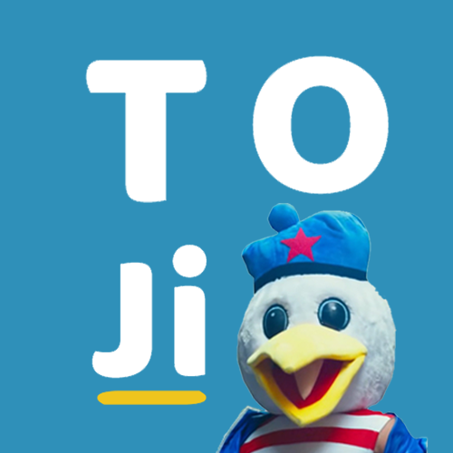
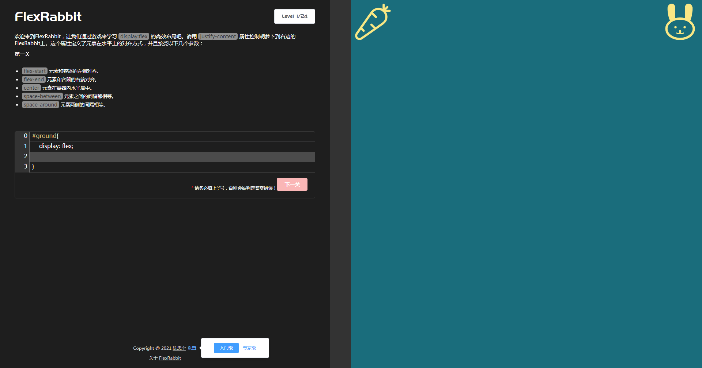

  

<h3 align="center">FlexRabbit 是一款通过输入CSS代码来学习弹性布局的游戏</h3>

<h2>目录</h2>
<ol>
<li><a href="#preface">前言</a></li>
<li><a href="#frame">框架</a></li>
<li><a href="#usage">用法</a></li>
<li><a href="#suggest">建议</a></li>
</ol>
 

<h2 id="preface">前言</h2>

偶然看到外国人开发了一款 <a href="https://flexboxfroggy.com/">FlexboxFroggy</a> 的网页游戏，目的是用来学习弹性布局，于是在好奇心的驱动下，用了一天时间去开发，成功复现了这个游戏。可以自信的说一句：“并没有去看这个开源游戏的源代码，而是通过基于Vue框架下，以100%自主开发的心态完成了复现，通过复现这个游戏，不仅能够学习弹性布局，更是对Vue框架有了进一步的认识！欢迎下载观看我的源码，实现方式其实很简单~”

<h2 id="frame">框架</h2>

本项目所使用的所有主要框架。
* [Vue](https://cn.vuejs.org/)
* [Element-UI](https://element.eleme.cn/)

<h2 id="usage">用法</h2>

	<ol>
		<li>一共有24关</li>
		<li>难度区分有入门级和专家级</li>
		<li>通过输入flex布局属性控制胡萝卜去喂养对应的兔子</li>
		<li>需要注意的是，在进入下一关后，并不会去储存上一关的内容</li>
	</ol>
	 
	

<h2 id="suggest">建议</h2>

新手玩家，可在通关游戏后，直接查看源代码（或不看），尝试复现一次，相信我，这会使得学习 html / css / js / vue / element 都非常有帮助。

<!-- Markdown 链接/图片 -->
[contributors-shield]: https://img.shields.io/github/followers/tanglaoji?style=for-the-badge

[stars-shield]: https://img.shields.io/github/stars/tanglaoji?style=for-the-badge

[linkedin-shield]: https://img.shields.io/badge/-LinkedIn-black.svg?style=for-the-badge&logo=linkedin&colorB=555
